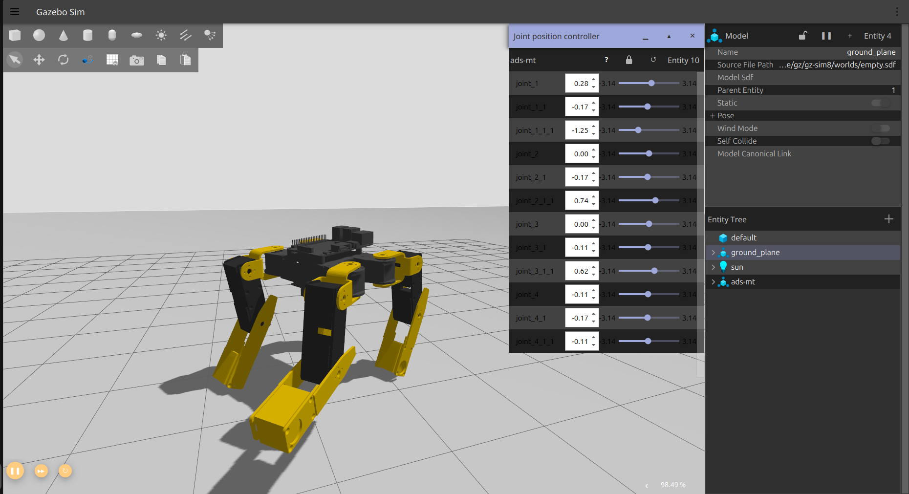

# Hardware Directory

- use `designs` under `adsmt_description/urdf` for simulation
- use `designs-raw` for printing

## Set up
- `ROS2 Jazzy` is required 
  - Ubuntu Installation, Ubuntu Noble Numnet, Ubuntu 24.0+ LTS
  - ```shell
    locale  # check for UTF-8

    sudo apt update && sudo apt install locales
    sudo locale-gen en_US en_US.UTF-8
    sudo update-locale LC_ALL=en_US.UTF-8 LANG=en_US.UTF-8
    export LANG=en_US.UTF-8
    
    locale  # verify settings
    
    sudo apt install software-properties-common
    sudo add-apt-repository universe
    
    sudo apt update && sudo apt install curl -y
    sudo curl -sSL https://raw.githubusercontent.com/ros/rosdistro/master/ros.key -o /usr/share/keyrings/ros-archive-keyring.gpg
    
    echo "deb [arch=$(dpkg --print-architecture) signed-by=/usr/share/keyrings/ros-archive-keyring.gpg] http://packages.ros.org/ros2/ubuntu $(. /etc/os-release && echo $UBUNTU_CODENAME) main" | sudo tee /etc/apt/sources.list.d/ros2.list > /dev/null
    
    sudo apt update && sudo apt install ros-dev-tools
    sudo apt update && sudo apt upgrade
    
    sudo apt install ros-jazzy-desktop
    ```
- refer to [ROS2 Jazzy Jalisco installation](https://docs.ros.org/en/jazzy/Installation.html) for other OS Platforms
- `Gazebo Harmonic` binary version is needed, refer to [Gazebo Harmonic binary installation](https://gazebosim.org/docs/harmonic/install_ubuntu/) for standalone cases
- use gazebo harmonics ros installation  
    ```shell
    sudo apt update
    sudo apt ros-jazzy-ros-gz
    ```

## Building
- jazzy builds upon `colcon`
  - ```shell
    colcon build --packages-select adsmt_description --symlink-install
    ```
    - Use `--symlink-install` for dealing with autonomous sourcing
- source
  - ```shell
    source install/local_setup.bash
    ```
  - Using `symlink` one needs to only source once, if needs rebuilding one can just run the program directly after build without the need of sourcing again.

## Running RVIZ
- `RviZ` is used as a markup viewer
  - ```shell
    ros2 launch adsmt_description display.launch.py
    ```
    
## Running Gazebo Simulation Endpoint
- `Gazebo` is a realistic simulation with mass, inertia and material forces added.
  - ```shell
    ros2 launch adsmt_description gzsim.launch.py
    ```
  - one should see
  - 

## Changelog
- `[Feb 1, 2025]` added RVIZ viewing capabilities
- `[Feb 3, 2025]` added Gazebo simulation successfully
